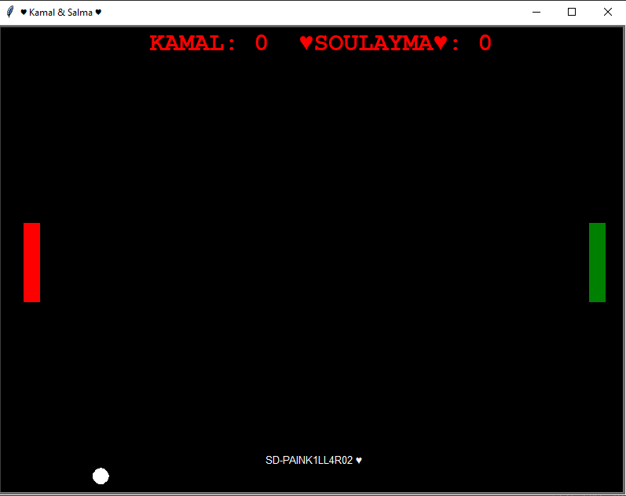

# SD-PAINK4ILL1R02 PONG GAME

#Gameplay: 
The player controls an in-game paddle by moving it vertically across the left or right side of the screen. They can compete against another player controlling a second paddle on the opposing side. Players use the paddles to hit a ball back and forth. The goal is for each player to reach eleven points before the opponent; points are earned when one fails to return the ball to the other

#Control:
* ** For KAMAL (red paddle) : w - up s - down For Soulayma (Green paddle) : ↑ - up ↓ - down

